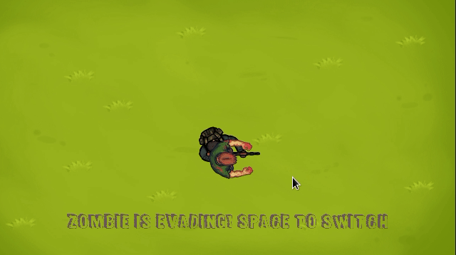

# This is an introductory series about Artificial intelligence (AI)

First topic moving in pattern:  
**Random Motion**

- Really basic use of libSDL2 and stdlib's rand function.
- Use of SDL2's RenderSetLogicalSize - resize the window

**Tracking**

- Really basic tracking/evading method.

Useful links:
[My SDL2-C page](https://acry.github.io/c.html)
